# Database Schema - Updated Class Diagram

## Cập nhật dựa trên code thực tế

```mermaid
classDiagram

    class TENANT {
        +string _id PK
        +string tenant_code
        +string name
        +string tenant_name
        +string tax_code
        +string status
        +json subscription
        +string subscription_plan
        +datetime subscription_expires_at
        +json contact
        +string contact_name
        +string contact_email
        +string contact_phone
        +json metadata
        +datetime created_at
        +datetime updated_at
    }

    class SUBSCRIPTION_PLAN {
        +string _id PK
        +string plan_name
        +string description
        +number price
        +number duration_months
        +string[] features
        +string status
        +datetime created_at
        +datetime updated_at
    }

    class SYSTEM_SETTINGS {
        +string _id PK
        +string system_name
        +string system_email
        +string system_phone
        +boolean enable_2fa
        +boolean enable_logging
        +boolean enable_auto_backup
        +number session_timeout
        +number max_login_attempts
        +datetime created_at
        +datetime updated_at
    }

    class SYSTEM_LOG {
        +string _id PK
        +string tenant_id FK
        +string user_id FK
        +string action
        +string module
        +mixed details
        +string ip_address
        +string user_agent
        +string severity
        +string session_id
        +datetime timestamp
        +datetime created_at
        +datetime updated_at
    }

    class BACKUP_RECORD {
        +string _id PK
        +string backup_type
        +string storage_location
        +string file_path
        +number file_size
        +string status
        +string error_message
        +string started_by FK
        +datetime completed_at
        +datetime created_at
        +datetime updated_at
    }

    class ORDER {
        +string _id PK
        +string tenantId FK
        +string orderId
        +string planType
        +number amount
        +string status
        +json companyInfo
        +json contactPerson
        +string paymentLink
        +string paymentTransactionId
        +string paymentOrderCode
        +string paymentBankCode
        +datetime paymentDate
        +string userId FK
        +datetime expiresAt
        +datetime created_at
        +datetime updated_at
    }

    class ROLE {
        +string _id PK
        +string tenant_id FK
        +string role_code
        +string role_name
        +number role_level
        +string description
        +json scope_rules
        +mixed permissions
        +boolean is_default
        +boolean is_active
        +datetime created_at
        +datetime updated_at
    }

    class USER {
        +string _id PK
        +number user_id
        +string tenant_id FK
        +string username
        +string password_hash
        +string email
        +string full_name
        +string phone
        +date birth_date
        +string address
        +string role_id FK
        +string department_id FK
        +boolean is_active
        +datetime last_login
        +datetime created_at
        +datetime updated_at
    }

    class DEPARTMENT {
        +string _id PK
        +string tenant_id FK
        +string department_name
        +string description
        +string manager_id FK
        +string[] manager_ids FK
        +boolean is_active
        +datetime created_at
        +datetime updated_at
    }

    class EMPLOYEE {
        +string _id PK
        +string user_id FK
        +string department_id FK
        +string position_id FK
        +date hire_date
        +string contract_type
        +boolean is_active
        +datetime created_at
        +datetime updated_at
    }

    class NOTIFICATION {
        +string _id PK
        +string tenant_id FK
        +number notification_id
        +mixed user_id FK
        +string title
        +string message
        +string type
        +string priority
        +string category
        +string action_url
        +datetime expires_at
        +boolean is_read
        +datetime created_at
    }

    class CHAT_HISTORY {
        +string _id PK
        +string userId FK
        +string sessionId
        +json messages
        +datetime createdAt
        +datetime updatedAt
    }

    class COURSE_SET {
        +string _id PK
        +string name
        +string description
        +datetime created_at
        +datetime updated_at
    }

    class COURSE {
        +string _id PK
        +string tenant_id FK
        +string course_set_id FK
        +string course_name
        +string description
        +number duration_hours
        +boolean is_mandatory
        +number validity_months
        +boolean is_deployed
        +datetime deployed_at
        +string deployed_by FK
        +datetime created_at
        +datetime updated_at
    }

    class QUESTION_BANK {
        +string _id PK
        +string course_id FK
        +string name
        +string description
        +datetime created_at
        +datetime updated_at
    }

    class QUESTION {
        +string _id PK
        +string bank_id FK
        +string content
        +string[] options
        +string correct_answer
        +number points
        +string explanation
        +string difficulty_level
        +datetime created_at
        +datetime updated_at
    }

    class TRAINING_SESSION {
        +string _id PK
        +string tenant_id FK
        +string department_id FK
        +string course_id FK
        +string session_name
        +datetime start_time
        +datetime end_time
        +number max_participants
        +string location
        +string status_code
        +datetime created_at
        +datetime updated_at
    }

    class TRAINING_ENROLLMENT {
        +string _id PK
        +string session_id FK
        +string user_id FK
        +datetime enrolled_at
        +string status
        +number score
        +boolean passed
        +datetime completion_date
        +datetime created_at
        +datetime updated_at
    }

    class PROJECT {
        +string _id PK
        +string tenant_id FK
        +string project_name
        +string description
        +date start_date
        +date end_date
        +date actual_start_date
        +date actual_end_date
        +string status
        +string leader_id FK
        +string created_by FK
        +string site_id FK
        +number progress
        +string priority
        +string project_type
        +string client_name
        +json client_contact
        +datetime created_at
        +datetime updated_at
    }

    class SITE {
        +string _id PK
        +string project_id FK
        +string site_name
        +string address
        +json coordinates
        +string description
        +string contact_person
        +string contact_phone
        +string contact_email
        +boolean is_active
        +datetime created_at
        +datetime updated_at
    }

    class SITE_AREA {
        +string _id PK
        +string site_id FK
        +string project_id FK
        +string area_code
        +string area_name
        +string area_type
        +string description
        +number area_size_sqm
        +string safety_level
        +string supervisor_id FK
        +json coordinates
        +number capacity
        +string special_requirements
        +boolean is_active
        +datetime created_at
        +datetime updated_at
    }

    class WORK_LOCATION {
        +string _id PK
        +string area_id FK
        +string project_id FK
        +string location_code
        +string location_name
        +string location_type
        +json coordinates_within_area
        +string access_requirements
        +number capacity
        +json safety_equipment_required
        +string special_instructions
        +boolean is_active
        +string created_by FK
        +string updated_by FK
        +datetime created_at
        +datetime updated_at
    }

    class PROJECT_TASK {
        +string _id PK
        +string tenant_id FK
        +string project_id FK
        +string parent_task_id FK
        +string task_code
        +string task_name
        +string description
        +number task_order
        +string task_type
        +datetime planned_start_date
        +datetime planned_end_date
        +datetime actual_start_date
        +datetime actual_end_date
        +number planned_duration_hours
        +number actual_duration_hours
        +number progress_percentage
        +string priority
        +string status
        +string area_id FK
        +string location_id FK
        +string responsible_user_id FK
        +string completion_criteria
        +json dependencies
        +datetime created_at
        +datetime updated_at
    }

    class TASK_ASSIGNMENT {
        +string _id PK
        +string task_id FK
        +string user_id FK
        +string role_in_task
        +datetime assigned_date
        +number allocated_hours
        +number actual_hours
        +string status
        +string notes
        +datetime created_at
        +datetime updated_at
    }

    class PPE_CATEGORY {
        +string _id PK
        +string tenant_id FK
        +string category_name
        +string description
        +string image_url
        +number lifespan_months
        +datetime created_at
        +datetime updated_at
    }

    class PPE_ITEM {
        +string _id PK
        +string tenant_id FK
        +string category_id FK
        +string item_code
        +string item_name
        +string brand
        +string model
        +string status
        +number reorder_level
        +number quantity_available
        +number quantity_allocated
        +number version
        +datetime expiry_date
        +datetime manufacturing_date
        +string batch_number
        +string[] serial_numbers
        +string condition_status
        +datetime last_maintenance_date
        +datetime next_maintenance_date
        +number maintenance_interval_days
        +datetime created_at
        +datetime updated_at
    }

    class PPE_STOCK {
        +string _id PK
        +string tenant_id FK
        +string department_id FK
        +string ppe_item_id FK
        +number quantity_available
        +number quantity_reserved
        +string location
        +datetime last_audited_at
        +json metadata
        +datetime created_at
        +datetime updated_at
    }

    class PPE_ISSUANCE {
        +string _id PK
        +string tenant_id FK
        +string user_id FK
        +string item_id FK
        +number quantity
        +datetime issued_date
        +datetime expected_return_date
        +string issued_by FK
        +string issuance_level
        +string manager_id FK
        +string status
        +datetime actual_return_date
        +string return_condition
        +string notes
        +string report_type
        +string report_description
        +string report_severity
        +datetime reported_date
        +number manager_remaining_quantity
        +number remaining_quantity
        +datetime confirmed_date
        +string confirmation_notes
        +datetime created_at
        +datetime updated_at
    }

    class INCIDENT {
        +string _id PK
        +string tenant_id FK
        +string project_id FK
        +string title
        +string description
        +string[] images
        +string location
        +string severity
        +string status
        +string incidentId
        +string assignedTo FK
        +string createdBy FK
        +boolean notified
        +json[] histories
        +datetime createdAt
    }

    class INCIDENT_ESCALATION {
        +string _id PK
        +string tenant_id FK
        +string department_id FK
        +string incident_id FK
        +string escalation_level
        +string reason
        +string status
        +string created_by FK
        +string resolved_by FK
        +datetime resolved_at
        +datetime created_at
        +datetime updated_at
    }

    class EQUIPMENT_STATUS {
        +string _id PK
        +string tenant_id FK
        +string department_id FK
        +string equipment_name
        +string equipment_code
        +string status
        +datetime last_inspected_at
        +datetime next_maintenance_at
        +string assigned_to FK
        +json metadata
        +datetime created_at
        +datetime updated_at
    }

    class MAINTENANCE_JOB {
        +string _id PK
        +string tenant_id FK
        +string department_id FK
        +string equipment_id FK
        +string title
        +string description
        +string priority
        +string status
        +datetime scheduled_date
        +datetime completed_date
        +string assigned_to FK
        +string created_by FK
        +json metadata
        +datetime created_at
        +datetime updated_at
    }

    %% Relationships
    TENANT "1" --> "*" SUBSCRIPTION_PLAN : has
    TENANT "1" --> "*" SYSTEM_SETTINGS : has
    TENANT "1" --> "*" SYSTEM_LOG : logs
    TENANT "1" --> "*" BACKUP_RECORD : backups
    TENANT "1" --> "*" ORDER : orders
    TENANT "1" --> "*" USER : users
    TENANT "1" --> "*" DEPARTMENT : departments
    TENANT "1" --> "*" ROLE : roles
    TENANT "1" --> "*" EMPLOYEE : employees
    TENANT "1" --> "*" NOTIFICATION : notifications
    TENANT "1" --> "*" COURSE : courses
    TENANT "1" --> "*" TRAINING_SESSION : training_sessions
    TENANT "1" --> "*" PROJECT : projects
    TENANT "1" --> "*" PROJECT_TASK : project_tasks
    TENANT "1" --> "*" PPE_CATEGORY : ppe_categories
    TENANT "1" --> "*" PPE_ITEM : ppe_items
    TENANT "1" --> "*" PPE_STOCK : ppe_stocks
    TENANT "1" --> "*" PPE_ISSUANCE : ppe_issuances
    TENANT "1" --> "*" INCIDENT : incidents
    TENANT "1" --> "*" INCIDENT_ESCALATION : incident_escalations
    TENANT "1" --> "*" EQUIPMENT_STATUS : equipment
    TENANT "1" --> "*" MAINTENANCE_JOB : maintenance_jobs

    ROLE "1" --> "*" USER : assigned
    DEPARTMENT "1" --> "*" USER : members
    USER "1" --> "1" EMPLOYEE : profile
    DEPARTMENT "1" --> "*" EMPLOYEE : employees

    COURSE_SET "1" --> "*" COURSE : courses
    COURSE "1" --> "*" QUESTION_BANK : banks
    QUESTION_BANK "1" --> "*" QUESTION : questions
    COURSE "1" --> "*" TRAINING_SESSION : sessions
    TRAINING_SESSION "1" --> "*" TRAINING_ENROLLMENT : enrollments
    USER "1" --> "*" TRAINING_ENROLLMENT : enrollments

    PROJECT "1" --> "*" SITE : sites
    SITE "1" --> "*" SITE_AREA : areas
    SITE_AREA "1" --> "*" WORK_LOCATION : locations
    PROJECT "1" --> "*" PROJECT_TASK : tasks
    PROJECT_TASK "1" --> "*" TASK_ASSIGNMENT : assignments
    PROJECT "1" --> "*" INCIDENT : incidents
    INCIDENT "1" --> "*" INCIDENT_ESCALATION : escalations

    PPE_CATEGORY "1" --> "*" PPE_ITEM : items
    PPE_ITEM "1" --> "*" PPE_STOCK : stocks
    PPE_ITEM "1" --> "*" PPE_ISSUANCE : issuances

    EQUIPMENT_STATUS "1" --> "*" MAINTENANCE_JOB : jobs
```

## Các thay đổi chính so với class diagram ban đầu:

### 1. **ORDER Model**
- ✅ Sửa `tenant_id` → `tenantId` (camelCase như code thực tế)

### 2. **INCIDENT Model**
- ✅ Thêm `project_id` field
- ✅ `histories` là array của embedded subdocument (IncidentHistorySchema), không phải bảng riêng

### 2.1. **INCIDENT_ESCALATION Model** (Bảng riêng)
- ✅ Bảng quản lý việc leo thang sự cố
- ✅ Có quan hệ 1-to-many với INCIDENT

### 3. **PPE_ISSUANCE Model**
- ✅ Thêm các fields: `report_type`, `report_description`, `report_severity`, `reported_date`
- ✅ Thêm `manager_remaining_quantity`, `remaining_quantity`
- ✅ Thêm `confirmed_date`, `confirmation_notes`

### 4. **DEPARTMENT Model**
- ✅ Thêm `manager_ids` (array) ngoài `manager_id`

### 5. **EMPLOYEE Model**
- ✅ Thêm `position_id` field

### 6. **USER Model**
- ✅ Thêm `user_id` (number, auto-increment)

### 7. **PPE_CATEGORY Model**
- ✅ Thêm `image_url` field

### 8. **PPE_ITEM Model**
- ✅ Thêm nhiều fields: `status`, `version`, `expiry_date`, `manufacturing_date`, `batch_number`, `serial_numbers`, `condition_status`, `last_maintenance_date`, `next_maintenance_date`, `maintenance_interval_days`

## Ghi chú:

1. **Naming Convention**: Một số models dùng `tenant_id` (snake_case), một số dùng `tenantId` (camelCase). Cần thống nhất.
2. **Tenant Isolation**: Một số models thiếu `tenant_id` có thể cần thêm để đảm bảo multi-tenancy (QUESTION_BANK, SITE, TASK_ASSIGNMENT, CHAT_HISTORY, COURSE_SET).
3. **Relationships**: Tất cả các relationships chính đã được định nghĩa trong diagram.
