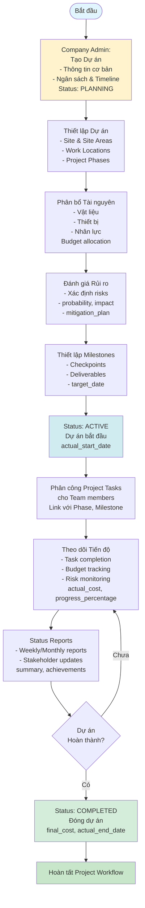

# 📋 Tài Liệu Luồng Xử Lý Dự Án (Project Management)

## 📑 Mục Lục

1. [Tổng Quan](#tổng-quan)
2. [Kiến Trúc Hệ Thống](#kiến-trúc-hệ-thống)
3. [Luồng Xử Lý Chi Tiết](#luồng-xử-lý-chi-tiết)
4. [API Endpoints](#api-endpoints)
5. [Quyền Truy Cập](#quyền-truy-cập)
6. [Bảo Mật và Phân Quyền](#bảo-mật-và-phân-quyền)
7. [WebSocket và Events](#websocket-và-events)
8. [Database Schema](#database-schema)
9. [Frontend Integration](#frontend-integration)
10. [Validation và Utils](#validation-và-utils)

---

## 🎯 Tổng Quan

### Mục Đích
Hệ thống quản lý dự án (Project Management) cho phép:
- **Company Admin**: Tạo dự án mới với thông tin cơ bản, ngân sách và timeline
- **Project Manager**: Thiết lập dự án, phân bổ tài nguyên, đánh giá rủi ro, thiết lập milestones, phân công tasks
- **Team Members**: Thực hiện tasks, cập nhật tiến độ, báo cáo
- **Tất cả roles**: Xem danh sách và thống kê dự án (theo phạm vi quyền)

### Trạng Thái (Status)
- `PLANNING`: Dự án đang trong giai đoạn lập kế hoạch
- `ACTIVE`: Dự án đang được thực hiện
- `COMPLETED`: Dự án đã hoàn thành
- `CANCELLED`: Dự án đã bị hủy
- `ON_HOLD`: Dự án tạm dừng

### Mức Độ Ưu Tiên (Priority)
- `LOW`: Ưu tiên thấp
- `MEDIUM`: Ưu tiên trung bình
- `HIGH`: Ưu tiên cao
- `URGENT`: Ưu tiên khẩn cấp

### Loại Dự Án (Project Type)
- `CONSTRUCTION`: Xây dựng
- `MAINTENANCE`: Bảo trì
- `RENOVATION`: Cải tạo
- `INSPECTION`: Kiểm tra
- `SAFETY`: An toàn
- `TRAINING`: Đào tạo

---

## 🏗️ Kiến Trúc Hệ Thống

### Cấu Trúc Thư Mục

```
DATN_BACKEND/
├── models/
│   ├── project.js                    # Mongoose schema cho Project
│   ├── projectTask.js                # Mongoose schema cho ProjectTask
│   ├── projectMilestone.js           # Mongoose schema cho ProjectMilestone
│   ├── projectRisk.js                # Mongoose schema cho ProjectRisk
│   ├── projectResource.js            # Mongoose schema cho ProjectResource
│   ├── projectStatusReport.js        # Mongoose schema cho ProjectStatusReport
│   ├── projectChangeRequest.js       # Mongoose schema cho ProjectChangeRequest
│   ├── projectAssignment.js          # Mongoose schema cho ProjectAssignment
│   ├── site.js                       # Mongoose schema cho Site
│   ├── siteArea.js                   # Mongoose schema cho SiteArea
│   └── workLocation.js               # Mongoose schema cho WorkLocation
├── controllers/
│   ├── projectController.js          # API endpoints handlers cho Project
│   ├── projectTaskController.js      # API endpoints handlers cho ProjectTask
│   ├── projectMilestoneController.js # API endpoints handlers cho ProjectMilestone
│   ├── projectRiskController.js      # API endpoints handlers cho ProjectRisk
│   ├── projectResourceController.js  # API endpoints handlers cho ProjectResource
│   ├── projectStatusReportController.js # API endpoints handlers cho StatusReport
│   └── projectChangeRequestController.js # API endpoints handlers cho ChangeRequest
├── services/
│   ├── projectService.js             # Business logic cho Project
│   ├── projectTaskService.js         # Business logic cho ProjectTask
│   ├── projectMilestoneService.js    # Business logic cho ProjectMilestone
│   ├── projectRiskService.js         # Business logic cho ProjectRisk
│   ├── projectResourceService.js     # Business logic cho ProjectResource
│   ├── projectStatusReportService.js # Business logic cho StatusReport
│   ├── projectChangeRequestService.js # Business logic cho ChangeRequest
│   └── projectAssignmentService.js   # Business logic cho Assignment
├── repository/
│   ├── projectRepository.js          # Database operations cho Project
│   ├── projectTaskRepository.js      # Database operations cho ProjectTask
│   ├── projectMilestoneRepository.js # Database operations cho ProjectMilestone
│   ├── projectRiskRepository.js      # Database operations cho ProjectRisk
│   ├── projectResourceRepository.js  # Database operations cho ProjectResource
│   ├── projectStatusReportRepository.js # Database operations cho StatusReport
│   ├── projectChangeRequestRepository.js # Database operations cho ChangeRequest
│   └── projectAssignmentRepository.js # Database operations cho Assignment
├── routes/
│   ├── projectRoutes.js              # Route definitions cho Project
│   ├── projectTaskRoutes.js          # Route definitions cho ProjectTask
│   ├── projectMilestoneRoutes.js     # Route definitions cho ProjectMilestone
│   ├── projectRiskRoutes.js          # Route definitions cho ProjectRisk
│   ├── projectResourceRoutes.js      # Route definitions cho ProjectResource
│   ├── projectStatusReportRoutes.js  # Route definitions cho StatusReport
│   └── projectChangeRequestRoutes.js # Route definitions cho ChangeRequest
├── validations/
│   └── projectValidation.js          # Input validation rules
└── events/
    ├── projectEvents.js              # Event emitters (Kafka) cho Project
    ├── projectRiskEvents.js          # Event emitters cho ProjectRisk
    ├── projectMilestoneEvents.js     # Event emitters cho ProjectMilestone
    ├── projectResourceEvents.js      # Event emitters cho ProjectResource
    └── projectStatusReportEvents.js  # Event emitters cho StatusReport
```

### Luồng Dữ Liệu

```
Frontend Request
    ↓
Route (projectRoutes.js)
    ↓
AuthMiddleware (Authentication & Authorization)
    ↓
ValidationMiddleware (Input Validation)
    ↓
Controller (projectController.js)
    ↓
Service (projectService.js)
    ↓
Repository (projectRepository.js)
    ↓
MongoDB
```

---

## 🔄 Luồng Xử Lý Chi Tiết

### 1. Tạo Dự Án (Create Project)

**Người thực hiện**: Company Admin, Project Manager

**Luồng xử lý**:

```
1. User điền form tạo dự án (project_name, description, start_date, end_date, leader_id, project_type, priority)
   ↓
2. Frontend gọi POST /api/v1/projects
   ↓
3. AuthMiddleware kiểm tra authentication và quyền 'create' trong module 'project'
   ↓
4. ValidationMiddleware validate dữ liệu đầu vào
   ↓
5. projectController.createProject() được gọi
   ↓
6. projectService.createProject() xử lý business logic:
   - Validate required fields
   - Validate dates (end_date > start_date)
   - Check leader exists
   - Check site exists (nếu có site_id)
   ↓
7. projectRepository.createProject() tạo record trong MongoDB:
   - Status mặc định: 'PLANNING'
   - Tự động set created_by = userId
   - Tự động set tenant_id từ user scope
   ↓
8. Emit WebSocket event: 'project_created'
   ↓
9. Emit Kafka event: PROJECT_CREATED
   ↓
10. Trả về response với project data đã được transform (_id → id)
```

**Điều kiện đầu vào**:
- User đã đăng nhập
- Có quyền tạo dự án (module: 'project', action: 'create')
- Các trường bắt buộc: `project_name`, `description`, `start_date`, `end_date`, `leader_id`
- `end_date` phải sau `start_date`
- `leader_id` phải tồn tại trong hệ thống

**Điều kiện đầu ra**:
- Project được tạo thành công với status = `PLANNING`
- WebSocket và Kafka events được emit
- Response trả về project data với format chuẩn

**Kết quả**:
- Project mới được tạo trong database
- Notification được gửi đến Project Leader
- Project xuất hiện trong danh sách dự án

---

### 2. Thiết Lập Dự Án (Setup Project)

**Người thực hiện**: Project Manager

**Luồng xử lý**:

```
1. Project Manager tạo Site (nếu chưa có):
   POST /api/v1/projects/sites
   - site_name, address, coordinates, contact_person, contact_phone, contact_email
   ↓
2. Project Manager tạo Site Areas:
   POST /api/v1/site-areas
   - area_code, area_name, area_type, area_size_sqm, safety_level, supervisor_id
   ↓
3. Project Manager tạo Work Locations:
   POST /api/v1/work-locations
   - location_code, location_name, location_type, coordinates_within_area
   ↓
4. Project Manager liên kết Site với Project:
   PUT /api/v1/projects/:id
   - site_id: <site_id>
   ↓
5. Hệ thống cập nhật project với site_id
```

**Điều kiện đầu vào**:
- Project đã tồn tại với status = `PLANNING`
- User có quyền update project
- Site, SiteArea, WorkLocation được tạo thành công

**Điều kiện đầu ra**:
- Project có đầy đủ thông tin địa điểm
- Site, SiteAreas, WorkLocations được liên kết với Project

**Kết quả**:
- Project có thể bắt đầu phân bổ tài nguyên và thiết lập milestones

---

### 3. Phân Bổ Tài Nguyên (Allocate Resources)

**Người thực hiện**: Project Manager

**Luồng xử lý**:

```
1. Project Manager tạo Project Resource:
   POST /api/v1/projects/:projectId/resources
   - resource_type: 'MATERIAL' | 'EQUIPMENT' | 'TOOL' | 'VEHICLE' | 'PERSONNEL' | 'SUBCONTRACTOR'
   - resource_name, description
   - planned_quantity, unit_measure
   - required_date, supplier_id (nếu có)
   ↓
2. projectResourceService.createResource() xử lý:
   - Validate required fields
   - Validate resource_type
   - Validate dates
   ↓
3. projectResourceRepository.createResource() tạo record:
   - Status mặc định: 'PLANNED'
   ↓
4. Emit Kafka event: PROJECT_RESOURCE_CREATED
   ↓
5. Trả về response với resource data
```

**Điều kiện đầu vào**:
- Project đã tồn tại
- User có quyền quản lý resources
- Các trường bắt buộc được điền đầy đủ

**Điều kiện đầu ra**:
- Resource được tạo thành công
- Status = `PLANNED`

**Kết quả**:
- Tài nguyên được phân bổ cho dự án
- Budget được phân bổ cho resources

---

### 4. Đánh Giá Rủi Ro (Risk Assessment)

**Người thực hiện**: Project Manager

**Luồng xử lý**:

```
1. Project Manager tạo Project Risk:
   POST /api/v1/projects/:projectId/risks
   - risk_name, description
   - risk_category: 'TECHNICAL' | 'SCHEDULE' | 'SAFETY' | 'ENVIRONMENTAL' | 'REGULATORY' | 'SUPPLIER' | 'PERSONNEL'
   - probability: 0-1
   - impact_score: 1-5
   - mitigation_plan
   - owner_id
   - target_resolution_date
   ↓
2. projectRiskService.createRisk() xử lý:
   - Validate required fields
   - Calculate risk_score = probability * impact_score
   ↓
3. projectRiskRepository.createRisk() tạo record:
   - Status mặc định: 'IDENTIFIED'
   - risk_score được tính tự động
   ↓
4. Emit Kafka event: PROJECT_RISK_CREATED
   ↓
5. Trả về response với risk data
```

**Điều kiện đầu vào**:
- Project đã tồn tại
- User có quyền quản lý risks
- probability: 0-1, impact_score: 1-5

**Điều kiện đầu ra**:
- Risk được tạo thành công
- risk_score được tính tự động
- Status = `IDENTIFIED`

**Kết quả**:
- Risk register được tạo
- Risk owner nhận notification

---

### 5. Thiết Lập Milestones (Setup Milestones)

**Người thực hiện**: Project Manager

**Luồng xử lý**:

```
1. Project Manager tạo Project Milestone:
   POST /api/v1/projects/:projectId/milestones
   - milestone_name, description
   - planned_date
   - milestone_type: 'PHASE_COMPLETION' | 'DELIVERY' | 'APPROVAL' | 'REVIEW' | 'CHECKPOINT'
   - completion_criteria
   - responsible_user_id
   - is_critical (boolean)
   ↓
2. projectMilestoneService.createMilestone() xử lý:
   - Validate required fields
   - Validate planned_date
   - Validate responsible_user_id exists
   ↓
3. projectMilestoneRepository.createMilestone() tạo record:
   - Status mặc định: 'PENDING'
   - progress mặc định: 0
   ↓
4. Emit Kafka event: PROJECT_MILESTONE_CREATED
   ↓
5. Trả về response với milestone data
```

**Điều kiện đầu vào**:
- Project đã tồn tại
- User có quyền quản lý milestones
- planned_date phải hợp lệ
- responsible_user_id phải tồn tại

**Điều kiện đầu ra**:
- Milestone được tạo thành công
- Status = `PENDING`
- progress = 0

**Kết quả**:
- Project có các checkpoints rõ ràng
- Responsible user nhận notification

---

### 6. Bắt Đầu Dự Án (Start Project)

**Người thực hiện**: Project Manager

**Luồng xử lý**:

```
1. Project Manager cập nhật status project:
   PUT /api/v1/projects/:id
   - status: 'ACTIVE'
   - actual_start_date: <current_date>
   ↓
2. projectService.updateProject() xử lý:
   - Validate status transition (PLANNING → ACTIVE)
   - Validate actual_start_date
   ↓
3. projectRepository.updateProject() cập nhật:
   - status = 'ACTIVE'
   - actual_start_date = current date
   ↓
4. Emit WebSocket event: 'project_updated'
   ↓
5. Emit Kafka event: PROJECT_UPDATED
   ↓
6. Trả về response với updated project data
```

**Điều kiện đầu vào**:
- Project status = `PLANNING`
- Setup hoàn tất (Site, Resources, Milestones đã được thiết lập)
- User có quyền update project

**Điều kiện đầu ra**:
- Project status = `ACTIVE`
- actual_start_date được set

**Kết quả**:
- Dự án bắt đầu
- Team members có thể nhận tasks

---

### 7. Phân Công Tasks (Assign Tasks)

**Người thực hiện**: Project Manager

**Luồng xử lý**:

```
1. Project Manager tạo Project Task:
   POST /api/v1/projects/:projectId/tasks
   - task_name, description
   - task_type: 'CONSTRUCTION' | 'INSPECTION' | 'DOCUMENTATION' | 'PLANNING' | 'COORDINATION' | 'SAFETY' | 'QUALITY'
   - planned_start_date, planned_end_date
   - planned_duration_hours
   - priority: 'LOW' | 'MEDIUM' | 'HIGH' | 'URGENT'
   - area_id, location_id
   - responsible_user_id
   - completion_criteria
   - dependencies (nếu có)
   ↓
2. projectTaskService.createTask() xử lý:
   - Validate required fields
   - Auto-generate task_code nếu không có
   - Validate dates
   - Validate dependencies
   ↓
3. projectTaskRepository.createTask() tạo record:
   - Status mặc định: 'PENDING'
   - progress_percentage mặc định: 0
   - task_code được auto-generate
   ↓
4. Emit WebSocket event: 'task_created'
   ↓
5. Emit Kafka event: PROJECT_TASK_CREATED
   ↓
6. Trả về response với task data
```

**Điều kiện đầu vào**:
- Project status = `ACTIVE`
- User có quyền tạo tasks
- area_id, location_id phải tồn tại
- responsible_user_id phải tồn tại

**Điều kiện đầu ra**:
- Task được tạo thành công
- Status = `PENDING`
- Responsible user nhận notification

**Kết quả**:
- Team members nhận tasks
- Tasks được liên kết với Project, Phase, Milestone

---

### 8. Theo Dõi Tiến Độ (Track Progress)

**Người thực hiện**: Team Members, Project Manager

**Luồng xử lý**:

#### 8.1. Cập Nhật Task Progress

```
1. Team Member cập nhật task progress:
   PUT /api/v1/projects/:projectId/tasks/:taskId
   - progress_percentage: 0-100
   - actual_start_date (nếu bắt đầu)
   - actual_end_date (nếu hoàn thành)
   - status: 'IN_PROGRESS' | 'COMPLETED' | 'ON_HOLD'
   ↓
2. projectTaskService.updateTask() xử lý:
   - Validate progress_percentage: 0-100
   - Validate status transition
   - Auto-update actual_duration_hours
   ↓
3. projectTaskRepository.updateTask() cập nhật
   ↓
4. Auto-update project progress:
   - Calculate overall project progress từ tất cả tasks
   - Update project.progress
   ↓
5. Emit WebSocket event: 'task_updated'
   ↓
6. Emit Kafka event: PROJECT_TASK_UPDATED
   ↓
7. Trả về response với updated task data
```

#### 8.2. Cập Nhật Project Progress

```
1. Project Manager cập nhật project progress:
   PUT /api/v1/projects/:id/progress
   - progress: 0-100
   ↓
2. projectService.updateProjectProgress() xử lý:
   - Validate progress: 0-100
   - Get old progress for event
   ↓
3. projectRepository.updateProject() cập nhật:
   - progress = new value
   ↓
4. Emit WebSocket event: 'project_progress_updated'
   ↓
5. Emit Kafka event: PROJECT_PROGRESS_UPDATED
   ↓
6. Trả về response với updated project data
```

**Điều kiện đầu vào**:
- Project status = `ACTIVE`
- Task đã được tạo
- User có quyền update task/project

**Điều kiện đầu ra**:
- Progress được cập nhật
- Project progress được tính lại tự động

**Kết quả**:
- Dashboard hiển thị tiến độ realtime
- Stakeholders nhận thông báo về tiến độ

---

### 9. Tạo Status Reports (Create Status Reports)

**Người thực hiện**: Project Manager

**Luồng xử lý**:

```
1. Project Manager tạo Status Report:
   POST /api/v1/projects/:projectId/status-reports
   - report_date
   - overall_progress: 0-100
   - tasks_completed, tasks_in_progress, tasks_overdue
   - status_summary
   - key_achievements
   - upcoming_activities
   - risks_issues
   ↓
2. projectStatusReportService.createStatusReport() xử lý:
   - Validate required fields
   - Validate overall_progress: 0-100
   ↓
3. projectStatusReportRepository.createStatusReport() tạo record
   ↓
4. Emit Kafka event: PROJECT_STATUS_REPORT_CREATED
   ↓
5. Gửi notification cho stakeholders
   ↓
6. Trả về response với report data
```

**Điều kiện đầu vào**:
- Project đang active
- User có quyền tạo reports

**Điều kiện đầu ra**:
- Status Report được tạo thành công
- Stakeholders nhận notification

**Kết quả**:
- Báo cáo định kỳ được tạo
- Stakeholders được cập nhật về tiến độ dự án

---

### 10. Hoàn Thành Dự Án (Complete Project)

**Người thực hiện**: Project Manager

**Luồng xử lý**:

```
1. Project Manager cập nhật status project:
   PUT /api/v1/projects/:id
   - status: 'COMPLETED'
   - actual_end_date: <current_date>
   - progress: 100
   ↓
2. projectService.updateProject() xử lý:
   - Validate status transition (ACTIVE → COMPLETED)
   - Validate tất cả tasks đã completed (optional check)
   - Validate actual_end_date
   ↓
3. projectRepository.updateProject() cập nhật:
   - status = 'COMPLETED'
   - actual_end_date = current date
   - progress = 100
   ↓
4. Emit WebSocket event: 'project_completed'
   ↓
5. Emit Kafka event: PROJECT_COMPLETED
   ↓
6. Gửi notification cho tất cả stakeholders
   ↓
7. Trả về response với completed project data
```

**Điều kiện đầu vào**:
- Project status = `ACTIVE`
- Tất cả tasks quan trọng đã completed (optional)
- User có quyền complete project

**Điều kiện đầu ra**:
- Project status = `COMPLETED`
- actual_end_date được set
- progress = 100

**Kết quả**:
- Dự án được đóng
- Final report được tạo
- Stakeholders nhận thông báo

---

## 📡 API Endpoints

### Project Management

| Method | Endpoint | Mô tả | Quyền |
|--------|----------|-------|-------|
| GET | `/api/v1/projects` | Lấy danh sách dự án | `project:read` |
| GET | `/api/v1/projects/stats` | Lấy thống kê dự án | `project:read` |
| GET | `/api/v1/projects/search` | Tìm kiếm dự án | `project:read` |
| GET | `/api/v1/projects/user` | Lấy dự án của user | `project:read` |
| GET | `/api/v1/projects/:id` | Lấy chi tiết dự án | `project:read` |
| POST | `/api/v1/projects` | Tạo dự án mới | `project:create` |
| PUT | `/api/v1/projects/:id` | Cập nhật dự án | `project:update` |
| DELETE | `/api/v1/projects/:id` | Xóa dự án | `project:delete` |
| PUT | `/api/v1/projects/:id/progress` | Cập nhật tiến độ | `project:update` |
| GET | `/api/v1/projects/:projectId/timeline` | Lấy timeline dự án | `project:read` |

### Project Assignments

| Method | Endpoint | Mô tả | Quyền |
|--------|----------|-------|-------|
| GET | `/api/v1/projects/:projectId/assignments` | Lấy danh sách thành viên | `project:read` |
| POST | `/api/v1/projects/:projectId/assignments` | Thêm thành viên | `project:update` |
| PUT | `/api/v1/projects/assignments/:id` | Cập nhật assignment | `project:update` |
| DELETE | `/api/v1/projects/assignments/:id` | Xóa assignment | `project:update` |

### Project Tasks

| Method | Endpoint | Mô tả | Quyền |
|--------|----------|-------|-------|
| GET | `/api/v1/projects/:projectId/tasks` | Lấy danh sách tasks | `project:read` |
| GET | `/api/v1/projects/:projectId/tasks/:taskId` | Lấy chi tiết task | `project:read` |
| POST | `/api/v1/projects/:projectId/tasks` | Tạo task mới | `project:create` |
| PUT | `/api/v1/projects/:projectId/tasks/:taskId` | Cập nhật task | `project:update` |
| DELETE | `/api/v1/projects/:projectId/tasks/:taskId` | Xóa task | `project:delete` |

### Project Milestones

| Method | Endpoint | Mô tả | Quyền |
|--------|----------|-------|-------|
| GET | `/api/v1/projects/:projectId/milestones` | Lấy danh sách milestones | `project:read` |
| GET | `/api/v1/projects/:projectId/milestones/:milestoneId` | Lấy chi tiết milestone | `project:read` |
| POST | `/api/v1/projects/:projectId/milestones` | Tạo milestone mới | `project:create` |
| PUT | `/api/v1/projects/:projectId/milestones/:milestoneId` | Cập nhật milestone | `project:update` |
| DELETE | `/api/v1/projects/:projectId/milestones/:milestoneId` | Xóa milestone | `project:delete` |

### Project Risks

| Method | Endpoint | Mô tả | Quyền |
|--------|----------|-------|-------|
| GET | `/api/v1/projects/:projectId/risks` | Lấy danh sách risks | `project:read` |
| GET | `/api/v1/projects/:projectId/risks/:riskId` | Lấy chi tiết risk | `project:read` |
| POST | `/api/v1/projects/:projectId/risks` | Tạo risk mới | `project:create` |
| PUT | `/api/v1/projects/:projectId/risks/:riskId` | Cập nhật risk | `project:update` |
| DELETE | `/api/v1/projects/:projectId/risks/:riskId` | Xóa risk | `project:delete` |

### Project Resources

| Method | Endpoint | Mô tả | Quyền |
|--------|----------|-------|-------|
| GET | `/api/v1/projects/:projectId/resources` | Lấy danh sách resources | `project:read` |
| GET | `/api/v1/projects/:projectId/resources/:resourceId` | Lấy chi tiết resource | `project:read` |
| POST | `/api/v1/projects/:projectId/resources` | Tạo resource mới | `project:create` |
| PUT | `/api/v1/projects/:projectId/resources/:resourceId` | Cập nhật resource | `project:update` |
| DELETE | `/api/v1/projects/:projectId/resources/:resourceId` | Xóa resource | `project:delete` |

### Project Status Reports

| Method | Endpoint | Mô tả | Quyền |
|--------|----------|-------|-------|
| GET | `/api/v1/projects/:projectId/status-reports` | Lấy danh sách reports | `project:read` |
| GET | `/api/v1/projects/:projectId/status-reports/:reportId` | Lấy chi tiết report | `project:read` |
| POST | `/api/v1/projects/:projectId/status-reports` | Tạo report mới | `project:create` |
| PUT | `/api/v1/projects/:projectId/status-reports/:reportId` | Cập nhật report | `project:update` |
| DELETE | `/api/v1/projects/:projectId/status-reports/:reportId` | Xóa report | `project:delete` |

### Site Management

| Method | Endpoint | Mô tả | Quyền |
|--------|----------|-------|-------|
| GET | `/api/v1/projects/sites` | Lấy danh sách sites | `project:read` |
| GET | `/api/v1/projects/sites/:id` | Lấy chi tiết site | `project:read` |
| POST | `/api/v1/projects/sites` | Tạo site mới | `project:create` |
| PUT | `/api/v1/projects/sites/:id` | Cập nhật site | `project:update` |
| DELETE | `/api/v1/projects/sites/:id` | Xóa site | `project:delete` |

---

## 🔐 Quyền Truy Cập

### Permission Matrix

| Role | Create | Read | Update | Delete | Notes |
|------|--------|------|--------|--------|-------|
| **Admin** | ✅ | ✅ | ✅ | ✅ | Full access |
| **Company Admin** | ✅ | ✅ | ✅ | ✅ | Full access to company projects |
| **Project Manager** | ✅ | ✅ | ✅ | ❌ | Can create/update, cannot delete |
| **Department Header** | ✅ | ✅ | ✅ | ❌ | Can manage department projects |
| **Manager** | ✅ | ✅ | ✅ | ❌ | Can manage assigned projects |
| **Employee** | ❌ | ✅ | ⚠️ | ❌ | Can view, update own tasks only |

### Scope Control

- **Tenant Scope**: Tất cả queries tự động filter theo `tenant_id` của user
- **Department Scope**: Department Header chỉ thấy projects của department mình
- **Project Scope**: Team members chỉ thấy projects được assign

---

## 🛡️ Bảo Mật và Phân Quyền

### Authentication
- Tất cả endpoints yêu cầu JWT token
- Token được validate qua `AuthMiddleware.authenticate`

### Authorization
- Sử dụng `AuthMiddleware.authorizeScope()` với permission matrix
- Module: `project`
- Actions: `create`, `read`, `update`, `delete`, `list`

### Data Isolation
- **Tenant Isolation**: Tự động filter theo `tenant_id`
- **Department Isolation**: Filter theo department hierarchy
- **Project Isolation**: Filter theo project assignments

### Input Validation
- Sử dụng `ValidationMiddleware` với Joi schemas
- Validate trong `projectValidation.js`
- Validate dates, enums, required fields

---

## 🔔 WebSocket và Events

### WebSocket Events

| Event | Mô tả | Payload |
|-------|-------|---------|
| `project_created` | Dự án mới được tạo | `{ project, creator }` |
| `project_updated` | Dự án được cập nhật | `{ project, updater }` |
| `project_progress_updated` | Tiến độ dự án được cập nhật | `{ project, progress, updater }` |
| `project_assigned` | Dự án được assign | `{ project, assignee, assigner }` |
| `task_created` | Task mới được tạo | `{ task, project }` |
| `task_updated` | Task được cập nhật | `{ task, project }` |
| `milestone_achieved` | Milestone đạt được | `{ milestone, project }` |
| `risk_identified` | Risk mới được xác định | `{ risk, project }` |

### Kafka Events

| Event Type | Topic | Mô tả |
|------------|-------|-------|
| `PROJECT_CREATED` | `project-events` | Dự án được tạo |
| `PROJECT_UPDATED` | `project-events` | Dự án được cập nhật |
| `PROJECT_DELETED` | `project-events` | Dự án bị xóa |
| `PROJECT_ASSIGNED` | `project-events` | Dự án được assign |
| `PROJECT_PROGRESS_UPDATED` | `project-events` | Tiến độ được cập nhật |
| `PROJECT_MILESTONE_ACHIEVED` | `project-events` | Milestone đạt được |
| `PROJECT_DEADLINE_APPROACHING` | `project-events` | Deadline sắp đến |

---

## 🗄️ Database Schema

### Project Schema

```javascript
{
  tenant_id: ObjectId (ref: Tenant),
  project_name: String (required),
  description: String (required),
  start_date: Date (required),
  end_date: Date (required),
  actual_start_date: Date,
  actual_end_date: Date,
  status: Enum ['PLANNING', 'ACTIVE', 'COMPLETED', 'CANCELLED', 'ON_HOLD'],
  leader_id: ObjectId (ref: User, required),
  created_by: ObjectId (ref: User, required),
  site_id: ObjectId (ref: Site),
  progress: Number (0-100, default: 0),
  priority: Enum ['LOW', 'MEDIUM', 'HIGH', 'URGENT'],
  project_type: Enum ['CONSTRUCTION', 'MAINTENANCE', 'RENOVATION', 'INSPECTION', 'SAFETY', 'TRAINING'],
  client_name: String,
  client_contact: {
    name: String,
    email: String,
    phone: String
  },
  created_at: Date,
  updated_at: Date
}
```

### ProjectTask Schema

```javascript
{
  project_id: ObjectId (ref: Project, required),
  parent_task_id: ObjectId (ref: ProjectTask),
  task_code: String (required, unique),
  task_name: String (required),
  description: String,
  task_order: Number (min: 1),
  task_type: Enum ['CONSTRUCTION', 'INSPECTION', 'DOCUMENTATION', 'PLANNING', 'COORDINATION', 'SAFETY', 'QUALITY'],
  planned_start_date: Date (required),
  planned_end_date: Date (required),
  actual_start_date: Date,
  actual_end_date: Date,
  planned_duration_hours: Number (min: 0, required),
  actual_duration_hours: Number (min: 0, default: 0),
  progress_percentage: Number (0-100, default: 0),
  priority: Enum ['LOW', 'MEDIUM', 'HIGH', 'URGENT'],
  status: Enum ['PENDING', 'IN_PROGRESS', 'COMPLETED', 'ON_HOLD', 'CANCELLED'],
  area_id: ObjectId (ref: SiteArea, required),
  location_id: ObjectId (ref: WorkLocation, required),
  responsible_user_id: ObjectId (ref: User),
  completion_criteria: String,
  dependencies: [{
    task_id: ObjectId (ref: ProjectTask),
    dependency_type: Enum ['FINISH_TO_START', 'START_TO_START', 'FINISH_TO_FINISH', 'START_TO_FINISH'],
    lag_days: Number (min: 0)
  }],
  created_at: Date,
  updated_at: Date
}
```

### ProjectMilestone Schema

```javascript
{
  project_id: ObjectId (ref: Project, required),
  milestone_name: String (required),
  description: String,
  planned_date: Date (required),
  actual_date: Date,
  milestone_type: Enum ['PHASE_COMPLETION', 'DELIVERY', 'APPROVAL', 'REVIEW', 'CHECKPOINT'],
  completion_criteria: String (required),
  status: Enum ['PENDING', 'IN_PROGRESS', 'COMPLETED', 'OVERDUE', 'CANCELLED'],
  progress: Number (0-100, default: 0),
  responsible_user_id: ObjectId (ref: User, required),
  is_critical: Boolean (default: false),
  created_by: ObjectId (ref: User),
  updated_by: ObjectId (ref: User),
  created_at: Date,
  updated_at: Date
}
```

### ProjectRisk Schema

```javascript
{
  project_id: ObjectId (ref: Project, required),
  phase_id: ObjectId (ref: ProjectPhase),
  risk_name: String (required),
  description: String (required),
  risk_category: Enum ['TECHNICAL', 'SCHEDULE', 'SAFETY', 'ENVIRONMENTAL', 'REGULATORY', 'SUPPLIER', 'PERSONNEL'],
  probability: Number (0-1, required),
  impact_score: Number (1-5, required),
  risk_score: Number (0-5, required), // Calculated: probability * impact_score
  mitigation_plan: String (required),
  owner_id: ObjectId (ref: User, required),
  status: Enum ['IDENTIFIED', 'PENDING', 'IN_PROGRESS', 'RESOLVED', 'CLOSED'],
  progress: Number (0-100, default: 0),
  identified_date: Date (required, default: Date.now),
  target_resolution_date: Date (required),
  actual_resolution_date: Date,
  schedule_impact_days: Number (min: 0, default: 0),
  created_at: Date,
  updated_at: Date
}
```

### ProjectResource Schema

```javascript
{
  project_id: ObjectId (ref: Project, required),
  resource_type: Enum ['MATERIAL', 'EQUIPMENT', 'TOOL', 'VEHICLE', 'PERSONNEL', 'SUBCONTRACTOR'],
  resource_name: String (required),
  description: String,
  planned_quantity: Number (min: 0, required),
  actual_quantity: Number (min: 0, default: 0),
  unit_measure: String (required),
  supplier_id: ObjectId (ref: Supplier),
  supplier_name: String,
  required_date: Date (required),
  delivered_date: Date,
  status: Enum ['PLANNED', 'ORDERED', 'DELIVERED', 'IN_USE', 'CONSUMED', 'RETURNED'],
  location: String,
  notes: String,
  created_at: Date,
  updated_at: Date
}
```

### ProjectStatusReport Schema

```javascript
{
  project_id: ObjectId (ref: Project, required),
  report_date: Date (required, default: Date.now),
  overall_progress: Number (0-100, required),
  tasks_completed: Number (min: 0, default: 0),
  tasks_in_progress: Number (min: 0, default: 0),
  tasks_overdue: Number (min: 0, default: 0),
  status_summary: String (required),
  key_achievements: String,
  upcoming_activities: String,
  risks_issues: String,
  reported_by: ObjectId (ref: User, required),
  created_at: Date,
  updated_at: Date
}
```

### ProjectChangeRequest Schema

```javascript
{
  project_id: ObjectId (ref: Project, required),
  change_title: String (required),
  description: String (required),
  change_type: Enum ['SCOPE', 'SCHEDULE', 'RESOURCE', 'QUALITY', 'TECHNICAL'],
  schedule_impact_days: Number (min: 0, default: 0),
  justification: String (required),
  requested_by: ObjectId (ref: User, required),
  requested_at: Date (required, default: Date.now),
  status: Enum ['PENDING', 'UNDER_REVIEW', 'APPROVED', 'REJECTED', 'IMPLEMENTED'],
  approved_by: ObjectId (ref: User),
  approved_at: Date,
  approval_notes: String,
  implementation_date: Date,
  created_at: Date,
  updated_at: Date
}
```

### Site Schema

```javascript
{
  project_id: ObjectId (ref: Project, required),
  site_name: String (required),
  address: String (required),
  coordinates: {
    latitude: Number,
    longitude: Number
  },
  description: String,
  contact_person: String,
  contact_phone: String,
  contact_email: String,
  is_active: Boolean (default: true),
  created_at: Date,
  updated_at: Date
}
```

### SiteArea Schema

```javascript
{
  site_id: ObjectId (ref: Site, required),
  project_id: ObjectId (ref: Project, required),
  area_code: String (required, unique),
  area_name: String (required),
  area_type: Enum ['CONSTRUCTION', 'STORAGE', 'OFFICE', 'SAFETY', 'EQUIPMENT', 'MEETING', 'REST'],
  description: String,
  area_size_sqm: Number (min: 0, required),
  safety_level: Enum ['LOW', 'MEDIUM', 'HIGH', 'CRITICAL'],
  supervisor_id: ObjectId (ref: User, required),
  coordinates: {
    latitude: Number,
    longitude: Number
  },
  capacity: Number (min: 1, default: 1),
  special_requirements: String,
  is_active: Boolean (default: true),
  created_at: Date,
  updated_at: Date
}
```

### WorkLocation Schema

```javascript
{
  area_id: ObjectId (ref: SiteArea, required),
  project_id: ObjectId (ref: Project, required),
  location_code: String (required, unique),
  location_name: String (required),
  location_type: Enum ['WORKSTATION', 'EQUIPMENT_AREA', 'MEETING_POINT', 'STORAGE', 'SAFETY_ZONE', 'REST_AREA'],
  coordinates_within_area: {
    x: Number,
    y: Number,
    z: Number
  },
  access_requirements: String,
  capacity: Number (min: 1, default: 1),
  safety_equipment_required: [{
    equipment_name: String,
    is_mandatory: Boolean (default: true)
  }],
  special_instructions: String,
  is_active: Boolean (default: true),
  created_by: ObjectId (ref: User, required),
  updated_by: ObjectId (ref: User),
  created_at: Date,
  updated_at: Date
}
```

---

## 💻 Frontend Integration

### Redux Store Structure

```typescript
{
  project: {
    projects: Project[],
    currentProject: Project | null,
    tasks: ProjectTask[],
    milestones: ProjectMilestone[],
    risks: ProjectRisk[],
    resources: ProjectResource[],
    statusReports: ProjectStatusReport[],
    loading: boolean,
    error: string | null,
    stats: {
      total: number,
      active: number,
      completed: number,
      planning: number,
      cancelled: number
    }
  }
}
```

### Key Components

- `ProjectManagement/index.tsx`: Main page component
- `ProjectList.tsx`: Danh sách dự án
- `ProjectDetail.tsx`: Chi tiết dự án
- `ProjectFormModal.tsx`: Form tạo/sửa dự án
- `ProjectTasks.tsx`: Quản lý tasks
- `ProjectMilestones.tsx`: Quản lý milestones
- `ProjectRisks.tsx`: Quản lý risks
- `ProjectResources.tsx`: Quản lý resources
- `ProjectStatusReports.tsx`: Quản lý status reports
- `ProjectOverview.tsx`: Tổng quan dự án

### API Service

```typescript
// services/projectService.ts
export const projectService = {
  getAllProjects: (filters) => api.get('/projects', { params: filters }),
  getProjectById: (id) => api.get(`/projects/${id}`),
  createProject: (data) => api.post('/projects', data),
  updateProject: (id, data) => api.put(`/projects/${id}`, data),
  deleteProject: (id) => api.delete(`/projects/${id}`),
  updateProgress: (id, progress) => api.put(`/projects/${id}/progress`, { progress }),
  // ... more methods
};
```

---

## ✅ Validation và Utils

### Validation Rules

**Create Project**:
- `project_name`: Required, string, max 200 chars
- `description`: Required, string
- `start_date`: Required, date, must be valid
- `end_date`: Required, date, must be after start_date
- `leader_id`: Required, valid ObjectId, must exist in User collection
- `project_type`: Required, enum
- `priority`: Optional, enum

**Update Project**:
- Same as create, but all fields optional
- Status transitions validated

**Create Task**:
- `task_name`: Required, string
- `project_id`: Required, valid ObjectId
- `planned_start_date`: Required, date
- `planned_end_date`: Required, date, must be after start_date
- `planned_duration_hours`: Required, number >= 0
- `area_id`: Required, valid ObjectId
- `location_id`: Required, valid ObjectId
- `task_type`: Required, enum

**Create Milestone**:
- `milestone_name`: Required, string
- `project_id`: Required, valid ObjectId
- `planned_date`: Required, date
- `completion_criteria`: Required, string
- `responsible_user_id`: Required, valid ObjectId
- `milestone_type`: Required, enum

**Create Risk**:
- `risk_name`: Required, string
- `project_id`: Required, valid ObjectId
- `description`: Required, string
- `risk_category`: Required, enum
- `probability`: Required, number 0-1
- `impact_score`: Required, number 1-5
- `mitigation_plan`: Required, string
- `owner_id`: Required, valid ObjectId
- `target_resolution_date`: Required, date

### Helper Functions

**Transform IDs**: `utils/transformId.js`
- `transformDocumentId()`: Transform _id to id for single document
- `transformDocumentsId()`: Transform _id to id for array of documents

**Response Format**: `utils/response.js`
- `createResponse()`: Create standardized response object
- `ApiResponse.success()`: Success response
- `ApiResponse.error()`: Error response

**Date Validation**: 
- Validate date ranges
- Check date formats
- Calculate durations

---

## 🔍 Troubleshooting

### Common Issues

1. **Project không hiển thị trong danh sách**
   - Kiểm tra tenant_id của user
   - Kiểm tra department scope
   - Kiểm tra project assignments

2. **Không thể update project**
   - Kiểm tra quyền update
   - Kiểm tra status transition hợp lệ
   - Kiểm tra tenant_id match

3. **Task không được assign**
   - Kiểm tra project status = ACTIVE
   - Kiểm tra area_id và location_id tồn tại
   - Kiểm tra responsible_user_id tồn tại

4. **Progress không cập nhật**
   - Kiểm tra progress_percentage: 0-100
   - Kiểm tra status transition hợp lệ
   - Kiểm tra WebSocket connection

5. **Milestone không đạt được**
   - Kiểm tra completion_criteria
   - Kiểm tra progress = 100
   - Kiểm tra status transition

---

## 📊 Workflow Diagram



---

## 📝 Notes

- Tất cả timestamps được tự động quản lý bởi Mongoose
- Tenant isolation được áp dụng tự động cho tất cả queries
- WebSocket events được emit realtime cho tất cả connected clients
- Kafka events được gửi cho analytics và audit logging
- Progress được tính tự động từ task completion
- Status transitions được validate nghiêm ngặt

---

**Tài liệu được tạo bởi**: AI Assistant  
**Ngày tạo**: 2025-01-14  
**Phiên bản**: 1.0

