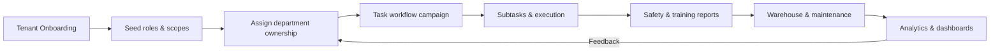

# Multi-tenant Operation Flow

## Detailed steps

1. **Tenant Onboarding**
   - Create the tenant record, run `npm run db:seed:tenants`, and capture the generated `_id`.
   - Assign `DEFAULT_TENANT_ID` (or pass the tenant explicitly to `getDefaultTenantObjectId()` in seed scripts).

2. **Role & scope seeding**
   - Load the 10 baseline roles plus any tenant-specific overrides.
   - Confirm `scope_rules` (`tenant_scope`, `department_scope`) reflect the real delegation model.

3. **Department hierarchy**
   - Map department heads/managers to their departments using the `DepartmentRepository`.
   - The hierarchy determines who can create campaigns or approve escalations.

4. **Task workflow loop**
   - Department Head creates a campaign (`/api/task-workflow/campaigns`).
   - Managers/Leaders break tasks down and assign them.
   - Employees update progress; every mutation writes `TaskWorkflowLog` entries with tenant filters.

5. **Safety & training feedback**
   - Trainers record sessions/assignments/assessments under the same tenant scope.
   - Safety officers submit reports, checklists, and incident escalations (again scoped via `enforceTenantFilter`).

6. **Warehouse & maintenance**
   - PPE stock/movements and requests use tenant/department scoping.
   - Maintenance equipment/jobs/logs capture the operational side and feed issues back into task workflows if needed.

7. **Reporting & analytics**
   - Aggregated data (KPIs, dashboards) respects the highest role scope: global (System Admin), tenant (Company Admin), department (Header/Manager).
   - Any feedback from analytics (e.g., backlog spikes) restarts the task workflow at step 4 for continuous improvement.

